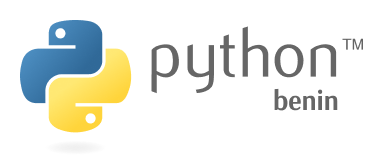

# roadmap

The roadmap for the Python Benin Users Group
> The purposes of the roadmap is to let everyone understand the direction the Python Users Benin Group is heading in both the short term and long term.

- [x] Buy a domain name [pythonbenin.org](https://pythonbenin.org)
- [ ] Set up a website for [pythonbenin.org](https://pythonbenin.org)
- [ ] Set up a Medium Blog for Python Users Benin Group
- [ ] Create a mailing list for Python Users Benin Group
- [ ] Create a Slack Group for Python Users Benin Group
- [x] Create a Github Organization for Python Users Benin Group
- [ ] Set up a Facebook Group for Python Users Benin Group
- [x] Create a Twitter Account for Python Users Benin Group
- [ ] Find one or more people to become part of the organizers team
- [ ] Define the style of meetings for the group
- [ ] Create a chapter on [Meetup.com](https://meetup.com)
- [ ] Define a Code of Conduct for Python Users Benin Group
- [ ] Organize the first meetup!
